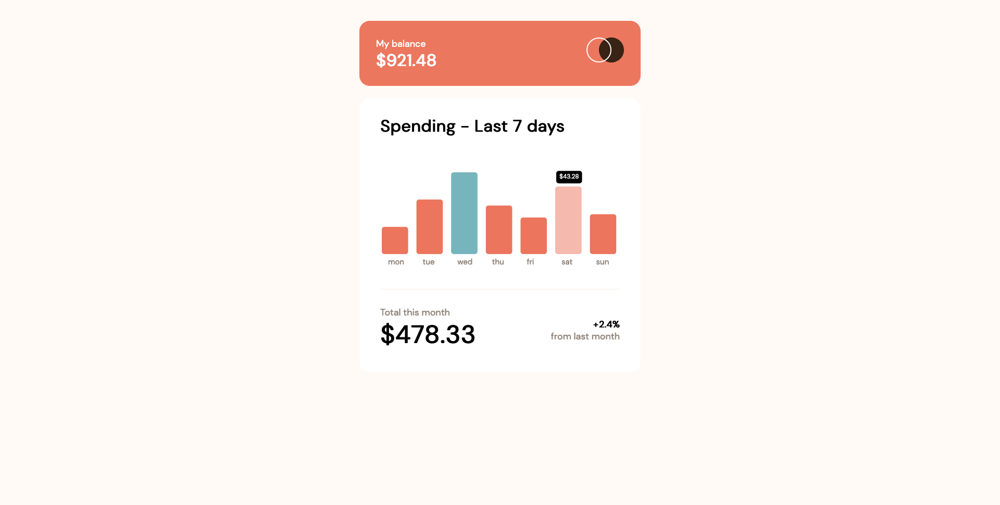

# Frontend Mentor - Expenses chart component solution

This is a solution to the [Expenses chart component challenge on Frontend Mentor](https://www.frontendmentor.io/challenges/expenses-chart-component-e7yJBUdjwt). Frontend Mentor challenges help you improve your coding skills by building realistic projects. 

## Table of contents

- [Overview](#overview)
  - [The challenge](#the-challenge)
  - [Screenshot](#screenshot)
  - [Links](#links)
- [My process](#my-process)
  - [Built with](#built-with)
  - [What I learned](#what-i-learned)
  - [Continued development](#continued-development)
  - [Useful resources](#useful-resources)
- [Author](#author)
- [Acknowledgments](#acknowledgments)

**Note: Delete this note and update the table of contents based on what sections you keep.**

## Overview

### The challenge

Users should be able to:

- View the bar chart and hover over the individual bars to see the correct amounts for each day
- See the current day’s bar highlighted in a different colour to the other bars
- View the optimal layout for the content depending on their device’s screen size
- See hover states for all interactive elements on the page
- **Bonus**: Use the JSON data file provided to dynamically size the bars on the chart

### Screenshot

### Links

- Solution URL: [https://www.frontendmentor.io/solutions/expense-management-graph-with-react-konva-abs-over-canvas-react-DVNXnWMaM_](https://www.frontendmentor.io/solutions/expense-management-graph-with-react-konva-abs-over-canvas-react-DVNXnWMaM_)
- Live Site URL: [https://tiny-pony-4175e3.netlify.app/](https://tiny-pony-4175e3.netlify.app/)

## My process

### Built with

- Flexbox
- CSS Grid
- [React](https://reactjs.org/) - JS library
- [React-konva](https://konvajs.org/docs/react/index.html) - Canvas API Abstraction

### What I learned

Using Canvas API is really tough, the low level api is powerfull to build any kind of rendering. But with use of Abstraction over libraries like Konva, it was easy to use.

Making Graph mobile responsive is more difficult than expected, since konva supports pixel and not rem, making it responsive with media query kinda tricky.

### Useful resources

- [React-konva](https://konvajs.org/docs/react/index.html) - Canvas API Abstraction

## Author

- Website - [nikeshnaik.dev](https://nikeshnaik.dev)
- Frontend Mentor - [@nikeshnaik](https://www.frontendmentor.io/profile/nikeshnaik)
- Twitter - [@nikeshinfinity](https://www.twitter.com/nikeshinfinity)

## Acknowledgments

To remove blurry text and lines in canvas api: 
https://stackoverflow.com/questions/15661339/how-do-i-fix-blurry-text-in-my-html5-canvas/65124939#65124939